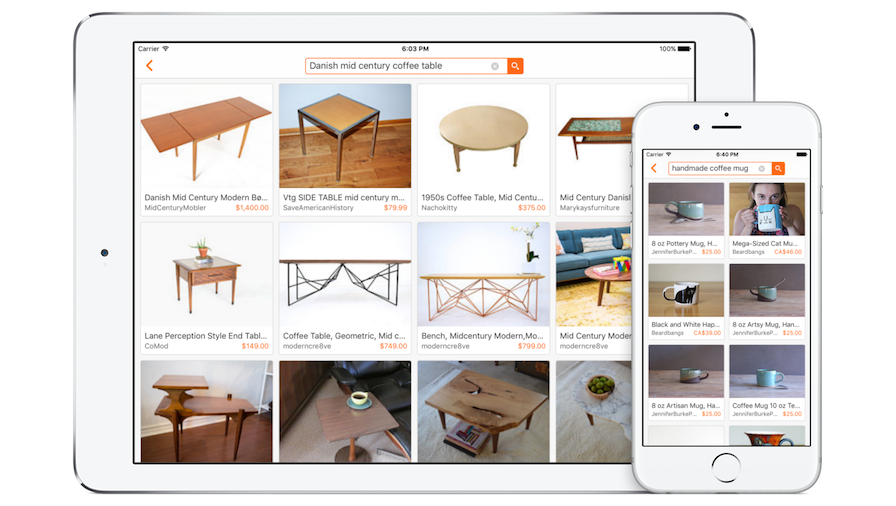

#Search on Etsy

##Features

####Home screen with animated transition to search results

It's not a great user experience if the first thing they see is an empty view with a tiny search bar at the top. I used [Google](https://www.google.com) as an example and created a more inviting home screen with a large search bar and a simple image above.

When transitioning to the search results screen, the search bar shrinks in size and animates up into the navigation bar. I made a quick [Keynote prototype](Resources/keynote-prototype.m4v) to test the look and feel of the transition before implementing it.

####Custom search bar

I wanted more control over the appearance and behaviour of the search bar than I was able to get from a UISearchBar. I created an IBDesignable view with IBInspectable properties so that I could adjust settings like border width and text color directly from the storyboard.

####View listing details

On the search results screen you can view a listing's image, title, shop name and price. Tap on a listing to view more details in a Safari View Controller.

####Supports iPhone & iPad

The collection view adjusts the size and layout of listing cards to fit iPhone and iPad screens in all orientations. I used [PaintCode](http://www.paintcodeapp.com/) to draw the icons displayed on the home screen so the line width remains constant when the icon is drawn at a range of sizes across devices.

####Using a third-party library written in Swift

This app is written in Objective-C, but I've used [one CocoaPod](https://github.com/ninjaprox/NVActivityIndicatorView) written in Swift. I had to make a [couple of minor tweaks](https://github.com/stephsharp/NVActivityIndicatorView/commits/objc-fixes) to get it working, but it meant that I could easily use the custom UI component I wanted without having to write my own in Objective-C.

##Notes on installation

All the pods are checked into source control, so there's no need to run `pod install`. Just clone the repo, build and run.

If you see any warnings in the storyboard (e.g. "Ignoring user defined runtime attribute for key path..."), you need to refresh the IBDesignable views. Go to Editor > Refresh All Views.
