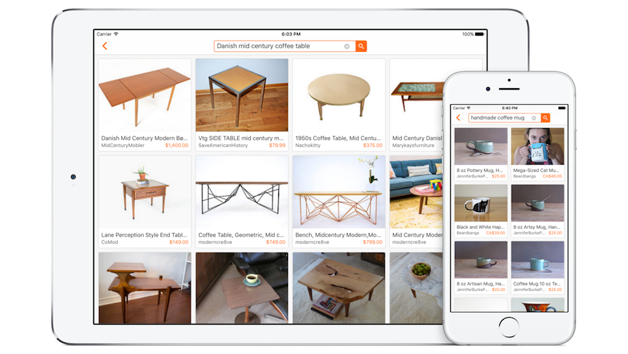
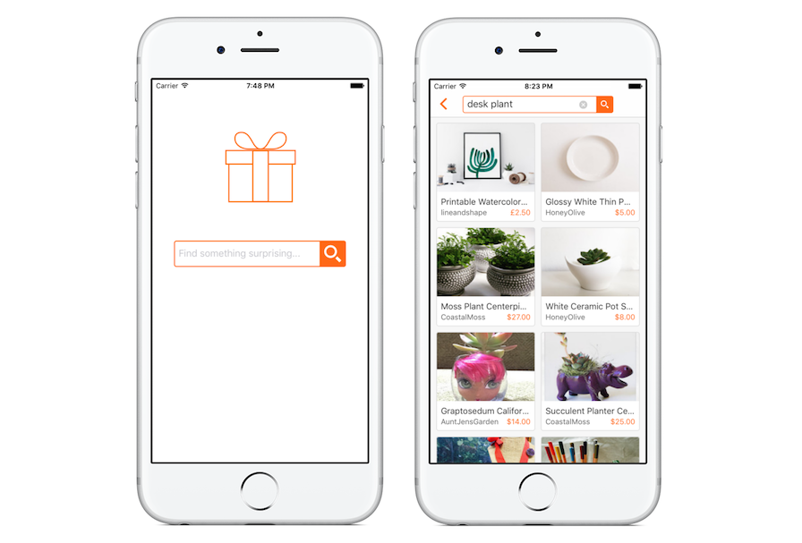

#Search on Etsy

##Features

####Home screen with animated transition

When a user sees an empty screen with a tiny search bar at the top, it doesn’t make for a great user experience. I used [Google](https://www.google.com) as an example and created a more inviting home screen with a large search bar and a simple image above.

When transitioning to the search results screen, the search bar shrinks in size and animates up into the navigation bar. I made a [Keynote prototype](Resources/keynote-prototype.m4v) to test the look and feel of the transition before implementing it.

####Custom search bar

I wanted more control over the appearance and behaviour of the search bar than I was able to get from a `UISearchBar`. I created an `IBDesignable` view with `IBInspectable` properties so that I could adjust settings like border width and text colour directly from the storyboard.

####View listings

On the search results screen you can view a listing's image, title, shop name and price. While the image is loading, the average colour of the image is used as a placeholder. Tap on a listing to view more details in Safari View Controller.

####Supports iPhone & iPad

The collection view adjusts the size and layout of listing cards to fit iPhone and iPad screens in all orientations. I used [PaintCode](http://www.paintcodeapp.com/) to draw the icons displayed on the home screen so the line width remains constant when the icon is drawn at a range of sizes across devices.

####Using Swift third-party library

This app is written in Objective-C, but I've used one CocoaPod written in Swift, [NVActivityIndicatorView](https://github.com/ninjaprox/NVActivityIndicatorView). I had to make a [couple of minor tweaks](https://github.com/stephsharp/NVActivityIndicatorView/commits/objc-fixes) to get it working, but it meant that I could easily use the custom UI component I wanted without having to write my own in Objective-C.

##Limitations & trade-offs

Here's a few limitations I came across and trade-offs I made:

- I would have liked to only return `MainImage` from the API instead of all `Images`, however `MainImage` does not include average colour information. Using `Images` is slower, so I decided to reduce the number of fetched results from 30 to 20 to offset the wait.
- I was hesitant to include all of AFNetworking just to get asynchronous image loading. I've tried a few alternatives in the past and prefer AFNetworking's image caching and reliability so I decided it was worth it.
- Showing and hiding a footer in a collection view was more difficult than I'd hoped. My implementation uses supplementary views, but I'm not convinced it was the best way to go. If I had more time, I would like to try some other ideas.
- The currency formatting for a listing's price is very basic. Ideally, all the prices would be displayed in the user's local or preferred currency instead of the currency they were created with.

##Up next

Here's what I would do next:

- Improve pagination. I would extract the paging logic out of the listings view controller and make use of the pagination information returned from the API instead of managing the offset myself.
- Improve the collection view layout. Try some different options for displaying the footer view in an attempt to simplify the logic involved in showing and hiding the loading indicator.
- Implement sorting and filtering of results.

##Installation

All the pods are checked into source control, so there's no need to run `pod install`. Just clone the repo, build and run.

If you see any warnings in the storyboard (e.g. _"Ignoring user defined runtime attribute for key path..."_), you need to refresh the IBDesignable views. Go to Editor > Refresh All Views.
